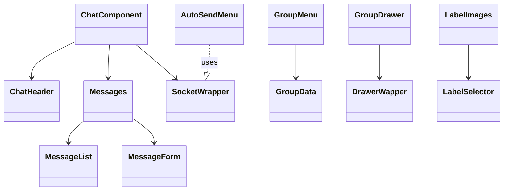

# NextGallery Frontend & Module Documentation 📚

Welcome to the in-depth guide covering the key components, modules, hooks, pages, and utilities in **this gallery & chat application**. This document focuses on the files you listed, explaining **what they do**, **how they relate**, and **how data/UI flows** between them.

---

## 📑 Table of Contents

1. [AlbumsComponent](#1-albumscomponent)  
2. [DevComp (Developer Chat)](#2-devcomp-developer-chat)  
3. [FavouriteComponent](#3-favouritecomponent)  
4. [Loaders](#4-loaders)  
5. [MapComponents](#5-mapcomponents)  
6. [SearchComponents](#6-searchcomponents)  
7. [peopleComponents](#7-peoplecomponents)  
8. [postComponents](#8-postcomponents)  
9. [Core MyComponents & Layouts](#9-core-mycomponents--layouts)  
10. [_lib Utilities](#10-_lib-utilities)  
11. [Next.js Pages & API](#11-nextjs-pages--api)  
12. [UI Primitives (components/ui)](#12-ui-primitives-componentsui)  
13. [Hooks & Miscellaneous](#13-hooks--miscellaneous)  

---

## 1. AlbumsComponent 🎨

A suite of React components handling **album creation**, **filtering**, **display**, and **image management**.

| Component                   | Purpose                                                                                             |
|-----------------------------|-----------------------------------------------------------------------------------------------------|
| **AddAlbumForm.jsx**        | Form UI to create a new album (title, description, cover image).                                    |
| **AlbumFilter.jsx**         | Input controls (search, dropdowns) to filter existing albums.                                       |
| **AlbumGrid.jsx**           | Renders a grid of **AlbumCard** components.                                                         |
| **AlbumCard.jsx**           | Displays an album thumbnail, title, and metadata (image count, date).                               |
| **AlbumWrapper.jsx**        | Top-level container orchestrating filter, grid, and add-new-album form.                              |
| **ImageAlbumAddLayout.jsx** | Layout for adding images into a selected album (drag-drop zone, instructions).                      |
| **ImageCardGrid.jsx**       | Grid view of **image cards** when adding or browsing album’s images.                                |
| **ImageModel.jsx**          | Modal/lightbox to preview a single image with details/actions (delete, edit).                       |
| **PasteCards.jsx**          | Allows pasting multiple images at once (clipboard support) into album add flow.                     |

### AlbumsComponent Data & UI Flow

```mermaid
flowchart TD
  A[User opens Albums page] --> B[AlbumWrapper]
  B --> C[AlbumFilter]
  B --> D[AddAlbumForm]
  B --> E[AlbumGrid]
  E --> F[AlbumCard] -->|click| G[ImageAlbumAddLayout]
  G --> H[ImageCardGrid] -->|select| I[PasteCards]
  F -->|view| J[ImageModel]
  D -->|submit| K[createAlbum() API] -->|success| E
```

1. **AlbumWrapper** brings together filtering, grid display, and album creation.  
2. **AlbumFilter** refines the album list (fed into AlbumGrid).  
3. **AddAlbumForm** posts new albums to the backend; on success, refreshes grid.  
4. Clicking an **AlbumCard** loads that album into **ImageAlbumAddLayout**, which uses **ImageCardGrid** and **PasteCards** to manage images.  
5. **ImageModel** pops up for a detailed preview or editing of a single image.

---

## 2. DevComp (Developer Chat) 💬

Components under **_MyComponents/DevComp** enable a **real-time group chat & auto-send** feature for development/testing.

| Component               | Purpose                                                                                  |
|-------------------------|------------------------------------------------------------------------------------------|
| **SocketWrapper.jsx**   | Initializes and provides a Socket.IO connection via React Context.                       |
| **IoMessages.jsx**      | Listens & emits socket events (join, message, leave, auto-send).                         |
| **ChatComponent.jsx**   | Main chat container; combines header, messages, and input form.                          |
| **ChatHeader.jsx**      | Displays chat title, group status, and controls (group menu toggle).                     |
| **Messages.jsx**        | Wraps **MessageList** and **MessageForm**; ensures real-time updates.                    |
| **MessageList.jsx**     | Renders a scrollable list of chat messages.                                              |
| **MessageForm.jsx**     | Input box + send button for new messages.                                                |
| **AutoSendMenu.jsx**    | UI to configure auto-send interval & toggle auto-sending of messages/images.             |
| **GroupMenu.jsx**       | Dropdown menu to select or create chat groups; uses **GroupData**.                       |
| **GroupData.jsx**       | Fetches & caches group metadata (member list, settings).                                 |
| **GroupDrawer.jsx**     | Sidebar drawer showing group members & settings.                                         |
| **LabelSelector.jsx**   | UI to tag/label images or messages within the chat.                                      |
| **LabelImages.jsx**     | Applies selected labels to images shared in chat.                                        |
| **StaticWrapper.jsx**   | Fallback UI for non-real-time contexts (e.g., offline demo).                             |
| **DrawerWapper.jsx**    | Higher-order component wrapping any drawer-based UI.                                      |
| **ContentWrapper.jsx**  | General layout wrapper for content panes (articles, forms, chat, etc.).                  |

### DevComp Component Relationship



- **SocketWrapper** is at the top-level of chat pages, exposing `socket` via context.  
- **ChatComponent** consumes `socket`, displays the **ChatHeader**, **Messages**, and triggers **IoMessages** events.  
- **GroupMenu** & **AutoSendMenu** collaborate via **GroupData** to manage group settings.  
- **DrawerWapper** and **ContentWrapper** provide cohesive layouts across DevComp.

---

## 3. FavouriteComponent ⭐️

- **FavouriteImage.jsx**  
  Displays a single image marked as favorite, with heart-toggle and context menu for actions (remove, share).  
  Used within **FavouriteGridWrapper** (core MyComponent) to showcase user-favourited images.

---

## 4. Loaders ⏳

Skeleton & shimmer loaders for various UI states:

| Loader                     | Use Case                                  |
|----------------------------|-------------------------------------------|
| **AlbumLoaders.jsx**       | Placeholder for album cards in loading.   |
| **AvatarLoader.jsx**       | Avatar/loading state in profiles.        |
| **ImageLoader.jsx**        | Single image placeholders.               |
| **MapSideImageLoader.jsx** | Images panel while map data loads.       |
| **MapSideOptionLoader.jsx**| Option badges in map side menu.          |
| **MessageLoader.jsx**      | Chat message skeletons.                  |
| **SearchLoader.jsx**       | Search results loading state.            |

---

## 5. MapComponents 🗺️

Mapping UI & side panels:

| Component           | Purpose                                                        |
|---------------------|----------------------------------------------------------------|
| **Map.jsx**         | Wrapper for map library (Leaflet/Google), initializes map.     |
| **MapWrapper.jsx**  | Layout wrapper combining map view and side panels.             |
| **MapView.jsx**     | Actual map canvas element & configuration.                     |
| **MapSideImages.jsx**| Thumbnails panel linked to map markers.                       |
| **MapSideOption.jsx**| Control panel for filtering map markers (region, type).      |
| **CountryCard.jsx** | Displays country info in side panel (flag, name, stats).      |
| **MarkerX.jsx**     | Custom map marker icon component.                              |

---

## 6. SearchComponents 🔍

Components supporting global search, sharing, and collaboration:

- **AddPeopleFolder.jsx** & **SelectPeople.jsx**: People selection UI for sharing.  
- **AddPopOver.jsx**: Pop-over menu for quick actions (share, delete).  
- **AlbumList.jsx** & **AlbumCardList.jsx**: Search results for albums, displayed as lists/cards.  
- **AutoSendSetting.jsx**: Integration point for DevComp’s auto-send within search flows.  
- **ChatWrapper.jsx**: Embeds a mini-chat for collaborative searches.  
- **Form1.jsx**, **Form2.jsx**: Reusable search/filter form patterns.  
- **GroupInfo.jsx**, **GroupMembers.jsx**, **LeaveDialog.jsx**, **SettingDialog.jsx**, **LInkDialog.jsx**: Dialogs and information panels around group sharing.  
- **ShareImages.jsx**, **SharedImageCard.jsx**, **CardWrapperShare.jsx**, **ShareWrapper.jsx**, **SharedButtons.jsx**: Full suite illustrating shareable images UI.  
- **IconButtons.jsx**, **SubTrigger.jsx**, **Temp.jsx**: Utility/temporary components for search UI.  
- **a.avif**: Default placeholder/share icon asset.

---

## 7. peopleComponents 👥

Profile & friends management:

- **FindFriend.jsx**, **SeachFriend.jsx**: Friend search inputs and results.  
- **FriendList.jsx**, **FriendListWrapper.jsx**, **Friends.jsx**: Display and manage friend lists.  
- **GroupsHolder.jsx**: Lists user groups/clubs.  
- **PeopleAvatar.jsx**, **PeopleAvatarFull.jsx**, **PeopleImage.jsx**: Avatar display in various sizes/states.  
- **PeopleWrapper.jsx**: Layout wrapper for people pages.  
- **SideProfile.jsx**: Sidebar user profile panel.

---

## 8. postComponents 📷

For creating new posts with camera integration:

| Component      | Purpose                                                       |
|----------------|---------------------------------------------------------------|
| **CameraUi.jsx**   | Controls for in-app camera capture (shutter, flip, flash). |
| **Camerawrapper.jsx**| Layout & preview for camera feed inside a modal/page.   |

---

## 9. Core MyComponents & Layouts 🏗️

General-purpose UI wrappers & forms:

- **AppSideBar.jsx**, **NavBar.jsx**, **BreadCrumb.jsx**, **SideSheet.jsx**, **SideFilterLayout.jsx**: App-wide navigation & layout utilities.  
- **AvatarDialog.jsx**, **AvatarPicker.jsx**, **AvatarForm.jsx**: Avatar upload/edit dialogs.  
- **BlurImage.jsx**, **NoImagesDoodle.jsx**, **NotFoundCard.jsx**, **WrapperNotFound.jsx**: Empty-state & decorative components.  
- **BodyWrapper.jsx**, **LayoutWrapper.jsx**, **Wrapper.jsx**: High-level page layout.  
- **EditableField.jsx**, **CoordinatesForm.jsx**, **Filter.jsx**, **FileForm.jsx**, **FunctionButtonsMid.jsx**: Form controls and editable patterns.  
- **ImageCard.jsx**, **ImageDetect.jsx**, **ImageWrapper.jsx**, **ImagesGrid.jsx**: Reusable image display & detection integration.  
- **LoadingButton.jsx**, **RefreshButton.jsx**, **Pagination.jsx**, **ToggleButton.jsx**: Buttons, toggles, pagination helpers.  
- **LoginForm.jsx**, **SignUpForm.jsx**, **SearchBar.jsx**, **MainSearchBar.jsx**: Auth & search forms.  
- **MainSlide.jsx**, **MyToast.jsx**, **PasteModule.jsx**, **PasteCardDummy.jsx**, **PrivacyControlSection.jsx**, **ThemeCard.jsx**, **UploadCard.jsx**: Miscellaneous UI modules.

---

## 10. _lib Utilities 🛠️

Shared JavaScript utilities:

- **actions.js**: Redux/action-like functions for CRUD operations.  
- **avatar.js**: Helpers to upload/generate avatar URLs.  
- **context.js**: React Context providers (user, theme, socket).  
- **countries.js**: Static country data & helpers.  
- **themes.js**: Theme configuration (light/dark palettes).  
- **utils.js**: Generic utilities (date formatting, cloning, debounce).

---

## 11. Next.js Pages & API 🚀

Key **app/** routes & API:

| Path                         | Role                                                                                   |
|------------------------------|----------------------------------------------------------------------------------------|
| **app/albums/page.js**       | Lists all albums.                                                                      |
| **app/albums/[id]/page.js**  | Displays a single album’s images, leverages AlbumsComponent.                           |
| **app/favourites/page.js**   | User’s favorite images page.                                                           |
| **app/people/page.js**       | Directory of users; uses peopleComponents.                                             |
| **app/people/[id]/page.js**  | Public profile page.                                                                   |
| **app/post/page.js**         | Create new post (camera integration).                                                  |
| **app/login/page.js**, **app/sign-up/page.js** | Auth flows.                                  |
| **app/share/page.js**        | Share dialog & routes.                                                                 |
| **app/settings/page.js**, **app/settings/themes/page.js**, **app/settings/layout.js** | User settings. |
| **app/memory-map/page.js**   | Interactive memory map; uses MapComponents.                                            |
| **app/api/cookie.js**        | Helper to read/write HTTP-only cookies (Auth).                                        |
| **app/layout.js**, **app/not-found.js**, **app/page.js** | Global layout & root error pages. |

---

## 12. UI Primitives (components/ui) 🎨

A curated library of low-level UI building blocks (buttons, cards, dialogs, forms, etc.), likely based on a design system (e.g., Radix + Tailwind):

- **alert, alert-dialog, badge, button, card, carousel, context-menu, dialog, drawer, dropdown-menu, form, input, label, navigation-menu, pagination, popover, scroll-area, separator, sheet, sidebar, skeleton, switch, tabs, toast, toaster, tooltip**  
- Each file exports styled primitives to ensure consistency across the app.

---

## 13. Hooks & Miscellaneous 🔌

- **hooks/use-mobile.jsx**: Detects mobile viewport & toggles UI accordingly.  
- **hooks/use-toast.js**: Abstraction over the toast notification system.  
- **lib/upload.js**: File/image upload helpers to cloud storage or backend.  
- **lib/utils.js**: Additional client/server utilities.  
- **public/**: Static assets (avatars, album cover vectors, face-model weights).  
- **next.config.mjs**, **middleware.js**, **tailwind.config.js**, **postcss.config.mjs**, **jsconfig.json**, **package.json**: Framework & build configuration.

---

## 🎯 Summary of Key Relationships

1. **AlbumsComponent** drives the album creation & browsing experience, feeding into Next.js pages at `/albums`.  
2. **DevComp** components are isolated under a “developer” or testing section, but share core **SocketWrapper** & **LabelSelector** logic with the rest.  
3. **MapComponents**, **SearchComponents**, **peopleComponents**, and **postComponents** each back distinct pages under **app/**, wiring their specialized UI into Next.js route handlers.  
4. **Core MyComponents** & **UI Primitives** form the foundation of the app’s look-and-feel—wrappers, forms, cards, loaders, and buttons used across pages.  
5. Utilities under **_lib** and **hooks/** provide cross-cutting concerns: context, theme, socket management, data formatting, and upload flows.  

By structuring components into feature-focused directories and layering in UI primitives and utilities, this repository achieves a **modular**, **reusable**, and **scalable** architecture—ideal for a rich gallery & real-time chat experience.
